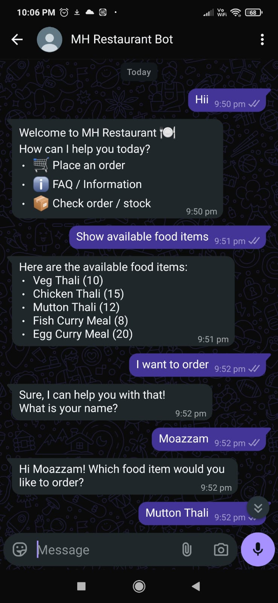
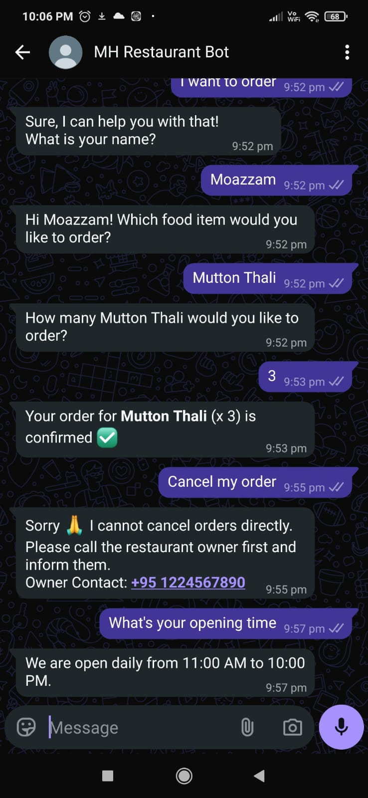
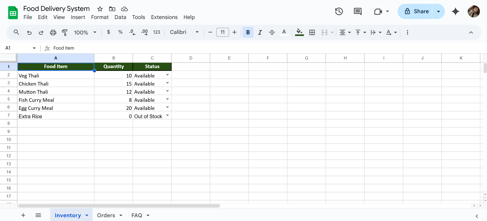
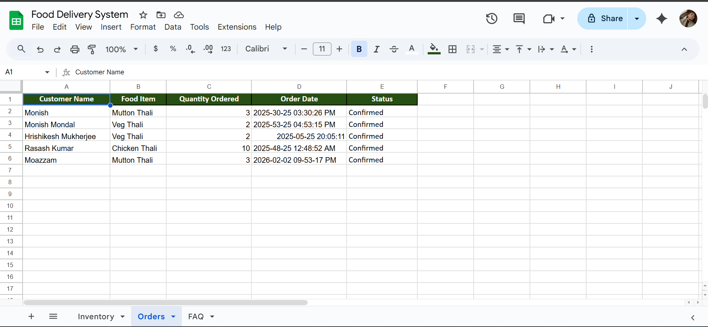
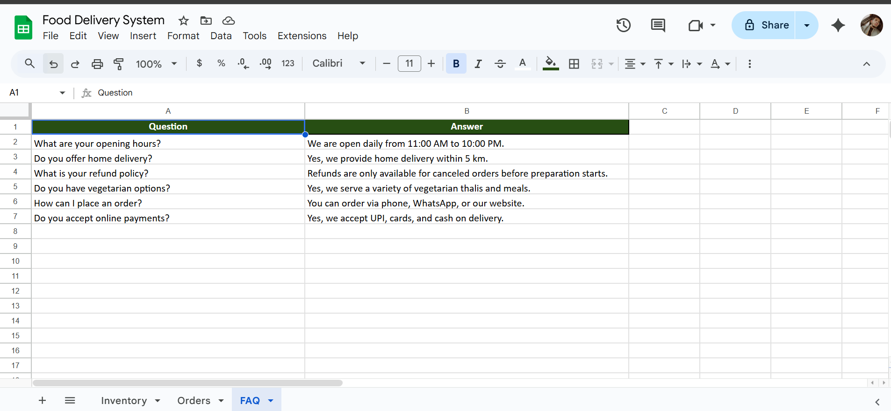

<h1 align="center">🍽️ MH Restaurant WhatsApp Bot</h1>

  A smart WhatsApp-based food ordering assistant with live inventory & order tracking

  
 
  

---

## 📌 Project Overview

MH Restaurant WhatsApp Bot is an AI-powered food ordering assistant that enables customers to place food orders, check live inventory, track order status, and get instant answers to FAQs directly on WhatsApp.

The system uses **Google Sheets as a real-time database** to manage inventory, orders, and FAQs, ensuring accurate order confirmation and smooth restaurant operations without the need for a website or mobile app.

---

## 🎯 Problem Statement

Small restaurants handling orders manually via WhatsApp or calls face:
- Order confusion and human errors  
- No real-time stock visibility  
- Repetitive customer queries  
- Difficulty tracking order status  

A simple, automated, and WhatsApp-based solution is required to streamline food ordering and inventory management.

---

## 💡 Solution

This project provides a **WhatsApp-based conversational bot** that:
- Guides users step-by-step to place orders
- Checks inventory before confirming orders
- Stores all orders automatically
- Answers FAQs instantly
- Provides a smooth food-delivery app–like experience

---

## 🚀 Key Features

- 🛒 Step-by-step food ordering flow  
- 📦 Live inventory validation before order confirmation  
- ❌ Automatic rejection for out-of-stock items  
- 📄 Order status tracking  
- ℹ️ Instant FAQ handling  
- 💬 WhatsApp-style short and friendly replies  

---

## 🧠 System Workflow

1. User sends a message on WhatsApp  
2. Bot identifies intent (order / stock / FAQ / status)  
3. Inventory is checked from Google Sheets  
4. Order is confirmed or rejected  
5. Order data is saved in Orders sheet  
6. FAQ answers are fetched dynamically  

---

## 🔄 Architecture / Automation Flow

**Components Used:**
- WhatsApp Trigger  
- AI Agent (Intent Handling)  
- Google Gemini Chat Model  
- Inventory Reader (Google Sheets)  
- Orders Writer (Google Sheets)  
- FAQ Reader (Google Sheets)  

---

## 💬 Live Demo Conversation

**Demo Highlights:**
- Greeting & menu options  
- Viewing available food items  
- Order placement & confirmation  
- Order cancellation handling  
- FAQ response (opening time)  

---

## 📊 Database (Google Sheets) Integration

### 📦 Inventory Sheet

- Food Item  
- Quantity  
- Status (Available / Out of Stock)

---

### 📄 Orders Sheet

- Customer Name  
- Food Item  
- Quantity Ordered  
- Order Date  
- Status (Confirmed / Rejected)

---

### ℹ️ FAQ Sheet

- Question  
- Answer  

---

## 🛠️ Tech Stack

- **Messaging Platform:** WhatsApp  
- **AI Model:** Google Gemini Chat Model  
- **Automation:** AI Agent-based Workflow  
- **Database:** Google Sheets  
- **APIs:** WhatsApp API, Google Sheets API  
- **Execution:** Cloud-based workflow engine  

---

## 🎯 Use Cases

- 🍴 Local Restaurants  
- ☁️ Cloud Kitchens  
- ⚡ Hackathon Projects  
- 🤖 Automation Demonstrations  

---

## 📞 Order Cancellation Policy

Orders cannot be cancelled directly through the bot.  
Customers are requested to contact the restaurant owner.

📱 **Owner Contact:** +95 1224567890  

---

## ⭐ Final Note

- Orders are confirmed only after inventory validation  
- Google Sheets acts as a live backend  
- Designed for simplicity, speed, and real-world usability  

---

  ⭐ If you like this project, don’t forget to star the repository!

